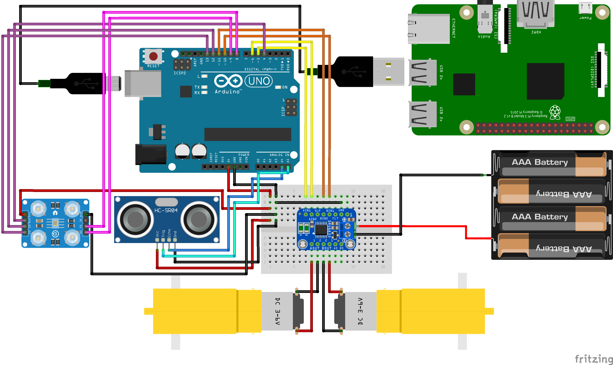
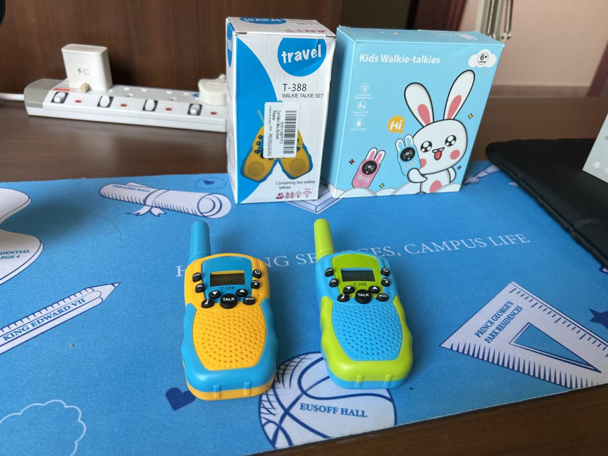
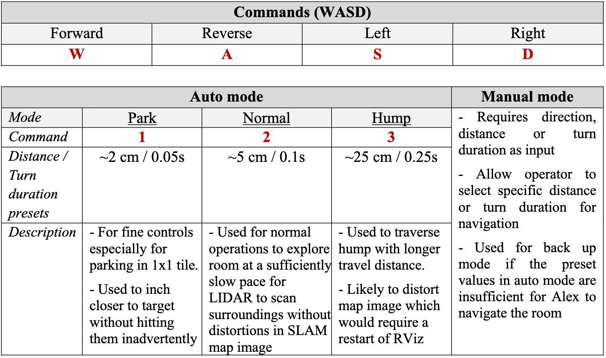
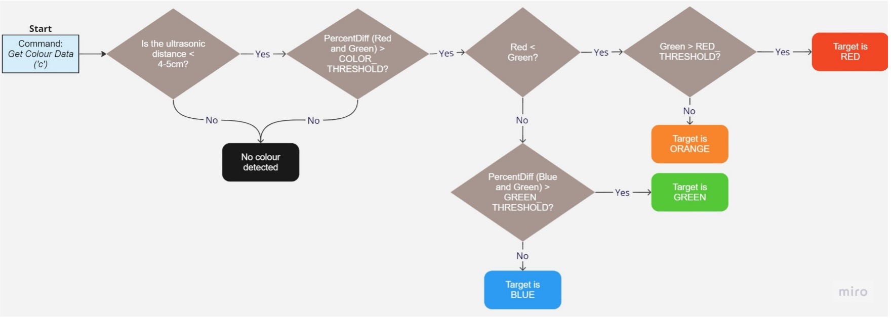

# Alex - The search & rescue robot

## Year 1 Semester 2 finale robot project for CG2111A module using RPLidar and Raspberry Pi.

Alex is a search and rescue robot designed to aid rescue efforts in the wake of natural disasters. Remotely controlled by an external operator, it can navigate through unfamiliar disaster terrains to detect presence of human life. 

In order to achieve this, a RPLidar sensor is mounted on Alex's top deck to map out its surroundings. The map will be relayed back to the operator who can reference it to remotely traverse Alex through the disaster terrain. Alex also has in-built voice communications via walkie-talkie to communicate with on-site emergency rescuers, further enhancing its search and rescue capabilities.

For more information, please view our report [here](/report.pdf).

<div align="center">


*Front (left) and Top (right) view of Alex*


*Side (left) and Bottom (right) view of Alex*

</div>

| Basic Hardware (Given) | Additional Features |
| ----------- | ----------- |
| 1. DRV8833 Dual H-Bridge motor driver <br> 2. Wheel encoders & Motors <br> 3. HC-SR04 Ultrasonic Sensor  <br> 4. A14-54-B-06 Color Sensor <br> 5. Arduino Uno <br> 6. Raspberry Pi 4 <br> 7. RPLidar | :white_check_mark: Aluminum heatsink casing with dual fan <br> :white_check_mark: Eyein UPRO-CHD32-2C Walkie Talkie <br> :white_check_mark: Improved control mapping and efficiency <br> :white_check_mark: Immediate command recognisation <br> :white_check_mark: Using Transform Frame (TF) to model Alex in RViz |

## Setting up Alex

The following are the overall hardware connections of Alex:
- The Raspberry Pi is powered by the external power bank
- RPLidar is powered by and communicates with the RPi via USB connection
- Arduino Uno is powered by and communicates with RPi via USB connection (USB B port)
- Alex's motors are powered by 4xAA batteries (via DRV8833 H-bridge)
- Connect the color sensor, ultrasonic sensor and wheel encoders to the Arduino Uno

<div align="center">



*Alex schematic diagram*

</div>

DRV8833 Dual H-bridge connections: 
<table>
<tr>
  <th></th>
  <th></th>
</tr>
<tr><td>

| DRV8833 pin | Connection |
| ----------- | ----------- |
| VIN | +ve of battery pack |
| GND | -ve of battery pack |
| BOUT1 | **Red** wire of RIGHT motor |
| BOUT2 | **Black** wire of RIGHT motor |
| AOUT1 | **Red** wire of LEFT motor |
| AOUT2 | **Black** wire of LEFT motor |

</td><td>

| DRV8833 pin | Connection |
| ----------- | ----------- |
| VMM | Do NOT connect |
| BIN1 | Arduino pin 10 |
| BIN2 | Arduino pin 11 |
| AIN1 | Arduino pin 5 |
| AIN2 | Arduino pin 6 |

</td></tr> </table>

Connections for other sensors:
<table>
<tr>
  <th style="text-align:center"> Color sensor </th>
  <th style="text-align:center"> Ultrasonic sensor </th>
  <th style="text-align:center"> Wheel encoders </th>
</tr>
<tr><td>

| TCS3200 pin | Connection |
| ----------- | ----------- |
| OUT | Arduino pin 4 |
| S0 | Arduino pin 9 |
| S1 | Arduino pin 8 |
| S2 | Arduino pin 12 |
| S3 | Arduino pin 13 |

</td><td>

| HC-SR04 pin | Connection |
| ----------- | ----------- |
| VCC | Arduino +5V |
| GND | Arduino GND |
| TRIG | Arduino pin A5 |
| ECHO | Arduino pin A4 |

</td><td>

| Hall effect sensor | Connection |
| ----------- | ----------- |
| VCC | Arduino +5V |
| GND | Arduino GND |
| Left encoder | Arduino pin 2 |
| Right encoder | Arduino pin 3 |

</td></tr> </table>

Once the hardware connections have been verified, upload the Arduino program called `Alex.ino` in `Alex` folder to the Arduino Uno. Other files`.ino` are tabs to the main file and should be compiled together. Ensure that they are recognised as tabs for the program to compile correctly.

Next, compile the `alex-pi.cpp` program to control Alex:
```bash
gcc alex-pi.cpp serial.cpp serialize.cpp -pthread -o Alex-pi
```

Run the generated executable file to start sending commands to the Arduino to operate Alex:
```bash
./Alex-pi
```

To view the map RPLidar generates:
```bash
source cg2111a/devel/setup.bash
roslaunch rplidar_ros view_slam.launch
```

## Hardware Features

| Item      | Description | Image | 
| ----------- | ----------- | ----------- |
| **Aluminum heatsink casing with dual fan** | The idle temperature of the RPi hovers around 50°C. The temperature would easily reach 70~80°C when we were running RViz, Hector SLAM and `Alex-pi` program simultaneously to operate Alex. At that temperature range, the RPi became less responsive, and it made it difficult to send commands to Alex and navigate it through the room. <br><br> With the casing mounted, the **maximum** temperature of the RPi is **45°C** when running all the necessary programs for operation, which is much lower than the original idle temperature without the casing. However, one drawback of this approach was the additional weight of the aluminum casing, which will be discussed in [limitations](#limitations). <br><br> Tip: If you want a quick alternative to offloading Hector SLAM onto another ROS device, use this but beware of the additional weight it adds to Alex!|  |
| **Eyein UPRO-CHD32-2C Walkie Talkie**   | We chose our additional functionality to be a microphone and speaker system via the use of two Walkie Talkies, one attached to the Alex and one for the operator. In the real-world context, when Alex detects a victim, the survivor can use the on-built microphone to communicate with emergency personnel. <br><br>  This system aids in transmission of instructions or knowledge of environmental conditions, where both parties can hear and speak clearly to one another remotely using the Walkie Talkie. This thus assists on-site rescuers to locate the trapped victims using details provided by the victim, on top of the navigation map. <br><br> The Walkie Talkie is mounted to the back of Alex using Velcro cable ties and operates using 4 integrated AAA batteries.|   |

## Software Features

### Improving control mapping and efficiency

The given template code uses controls: f (forward), b (reverse), l (left) and r (right) which are very unintuitive to operate Alex. We changed the mapping of the movement controls to the standard **WASD** keys, which is a popular key binding for video games. The added intuitive nature reduces the chance of keying the wrong command. 

<div align="center">



*Updated movement controls mapping*

</div>

- 2 main modes: Auto and Manual mode
    - In auto mode, each command will be recognised immediately without the need to click Enter (explained in next section) 
    - The distance for forward and reverse, and angle for left and right turns are preset
    - There are 3 modes (bound to 1,2,3 keys): **Park**, **Normal** and **Hump** modes, each with increasing values of distance and turn durations (as shown in table above)
- Changed turn command to be based on turn duration instead of angle to prevent motor stalls from freezing the program

**Other commands:**
| Command     | Key         | Description |
| ----------- | ----------- | ----------- |
| Get Color Data | **C** | Retrieve raw reflected R,G,B light values from color sensor and ultransonic distance to determine color of object in front based on [color detection algorithm](#color-detection-implementation) |
| Get Ultrasonic Data | **V** | Determine distance to objects in front of Alex in cm |
| Get Odometry Data | **E** | Retrieve number of turns made by each wheel and distance travelled by each wheel, and stored them as global variables |
| Clear Data | **R** | All global variables storing odometry data will be reset to 0 |
| End Serial Comms | **Q** | RPi will stop reading inputs from the keyboard and end serial communications with Arduino |
| Toggle Mode | **M** | Toggle between auto and manual modes |

After every movement command, the current Auto mode (**Park**, **Normal** and **Hump**) and the **ultrasonic distance** will be sent back to RPi. These information will be shown to the operator for better situational awareness while navigating Alex. 

### Immediate command recognisation

The original use of `scanf()` required the operator to click `Enter` after every command which was troublesome and unncessary. Hence, we used the following code snippet specific to Linux operating system so that the commands will be sent immediately after being entered. 

```cpp
#include <unistd.h>
#include <termios.h>

char getch() {
	char buf = 0;
	struct termios old = {0};
	if (tcgetattr(0, &old) < 0)
			perror("tcsetattr()");
	old.c_lflag &= ~ICANON;
	old.c_lflag &= ~ECHO;
	old.c_cc[VMIN] = 1;
	old.c_cc[VTIME] = 0;
	if (tcsetattr(0, TCSANOW, &old) < 0)
			perror("tcsetattr ICANON");
	if (read(0, &buf, 1) < 0)
			perror ("read()");
	old.c_lflag |= ICANON;
	old.c_lflag |= ECHO;
	if (tcsetattr(0, TCSADRAIN, &old) < 0)
			perror ("tcsetattr ~ICANON");
	return (buf);
}
```

This meant that the operater can send commands at a much faster rate which could unfortunately lead to **bad magic number** or **bad checksum** error if commands was sent while one is already in transmission. To address the issue, we need to ensure that a command has been received by the Arduino before the next command can be sent. This is achieved with the following steps:

- Maintain a global **`send_status`** flag that will be set to `true` when a command is sent. 
- While the flag is `true`, the RPi ignores any incoming commands from the operator as the previous command is still being sent to the Arduino.
- Set the flag to `false` when the RPi receives an OK packet, indicating that the Arduino has received the command successfully. 

```cpp
static bool send_status = false;

void handleResponse(TPacket *packet) {
	switch(packet->command) {
		case RESP_OK:
			printf("Command OK\n");
			send_status = false;
			break;
        ...
    }
}
   
int main() {
    ...
    if (!send_status) {
        send_status = true;
        sendCommand(ch, manual, &currentMode);
    }
    ...
}
```

### Using Transform Frame (TF) to model Alex in RViz

We were shown to display the pose of the lidar as an arrow on the map in RViz. However, this arrow is quite inaccurate at displaying the position of Alex on the generated map. 

Hence, we implemented additional markers that are positioned offset relative to the lidar’s position using **Transform Frame** (TF). Each marker by default is modeled with 3 axis which can be rotated to form the corners of Alex. We used 5 markers to outline the boundaries of Alex on the RViz map. (4 for each corner and 1 to return to the first marker)

<div align="center">


*Aluminum heatsink casing with dual fan*

</div>

The template to add one TF marker into RVis is shown below:

```xml
<launch>
<node pkg="tf2_ros" type="static_transform_publisher" name="marker_name" args="x y z yaw pitch roll parent_frame child_frame" />
</launch>
```

- `parent_frame`: Original frame (data) to take reference from
- `child_frame`: Final name of transformed frame (data)
- `marker_name`: Name of each marker to be shown in TF element in RVis
- `x`, `y`, `z`: Offset in x, y, z axes from `parent_frame`
- `yaw`, `pitch`, `roll`: Rotation (in radians) of marker relative to `parent_frame`

We added the following code snippet into the `view_slam.launch` file and add the `TF` element within RViz. Next, we also needed to display the correct markers within the TF settings to achieve the above effect.

```xml
<launch>
<node pkg="tf2_ros" type="static_transform_publisher" name="marker1" args="0.13 -0.06 0 1.57 0 0 laser topRight" />
<node pkg="tf2_ros" type="static_transform_publisher" name="marker2" args="0.14 0 0 1.57 0 0 topRight topLeft" />
<node pkg="tf2_ros" type="static_transform_publisher" name="marker3" args="0.2 0 0 1.57 0 0 topLeft bottomRight" /> 
<node pkg="tf2_ros" type="static_transform_publisher" name="marker4" args="0.14 0 0 1.57 0 0 bottomRight bottomLeft" /> 
<node pkg="tf2_ros" type="static_transform_publisher" name="marker5" args="0.2 0 0 1.57 0 0 bottomLeft close" />
</launch>
```

Tip: This is a quick and easy implementation, add this from the start of your project!

### Color detection implementation

Firstly, to recognise red and green targets, it is observed that reflected red and green components are fairly large. Hence, we check that the percentage difference between red and green light is larger than `COLOR_THRESHOLD`. After which, the main distinction between red or green targets is by comparing the reflected R and G values from the color sensor.

- If R < G, we know that the target is either red or orange. Next, we checked the reflected green value as we observed that red surfaces had more reflected green light as compared to orange. Hence, if G is greater than `RED_THRESHOLD` value, the target is red, else it is orange.

- Else, we deduce that the target is either green or blue. We noticed that green surfaces had similar amounts of green and blue light reflected while blue surfaces had a larger difference between green and blue reflected light. Hence, we then compared the percentage difference between the G and B values. If the difference is smaller than the `GREEN_THRESHOLD` value, the target is green, else it is blue. 

<div align="center">



*Color detection algorithm flowchart*

</div>

One observation when tuning the color sensor was that the reflected light values for each surface color varies based on the distance the sensor was away from the surface. Hence, color calibration and identification were **always** done when Alex was at a predetermined distance of around **4-5 cm** away from a surface with the help of the ultrasonic sensor for the best consistency and accuracy. 

## Limitations

The addition of the aluminum RPi casing and Walkie Talkie resulted in a considerable increase in the weight of Alex which inadvertently affected its performance. As a result, our motors had to operate at near 100% speed for optimal performance. During the runs, we experienced limited mobility towards the end of 8 minutes as the batteries were limited on charge capacity to support the added weight of our Alex. 

We could have solved this by using 1.5V Alkaline batteries that have higher voltage compared to the 1.33V NiMH Eneloop batteries. With this approach, more power can be supplied to the motors to operate our Alex which was heavier than normal over a longer period. 

To future groups considering to add additional hardware to their Alex, please run Alex through the course for the full duration to ensure that weight/power is not an issue!
