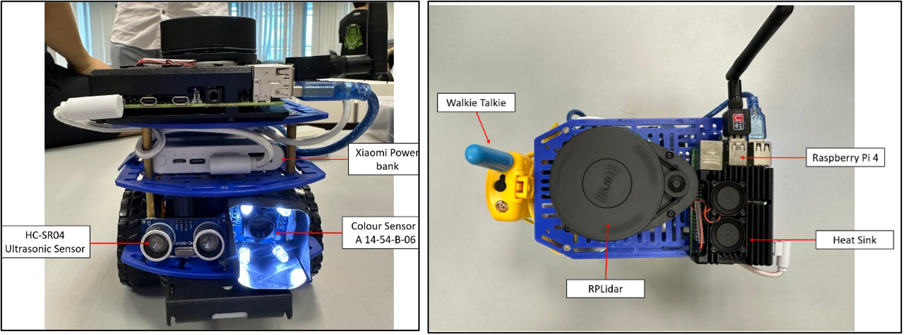
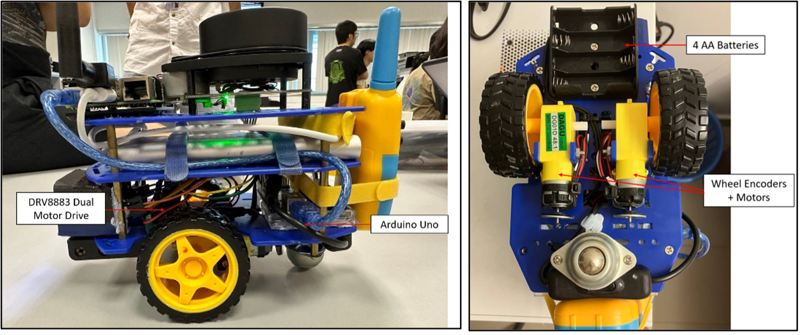
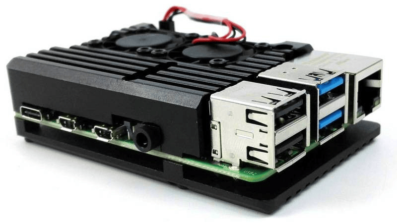
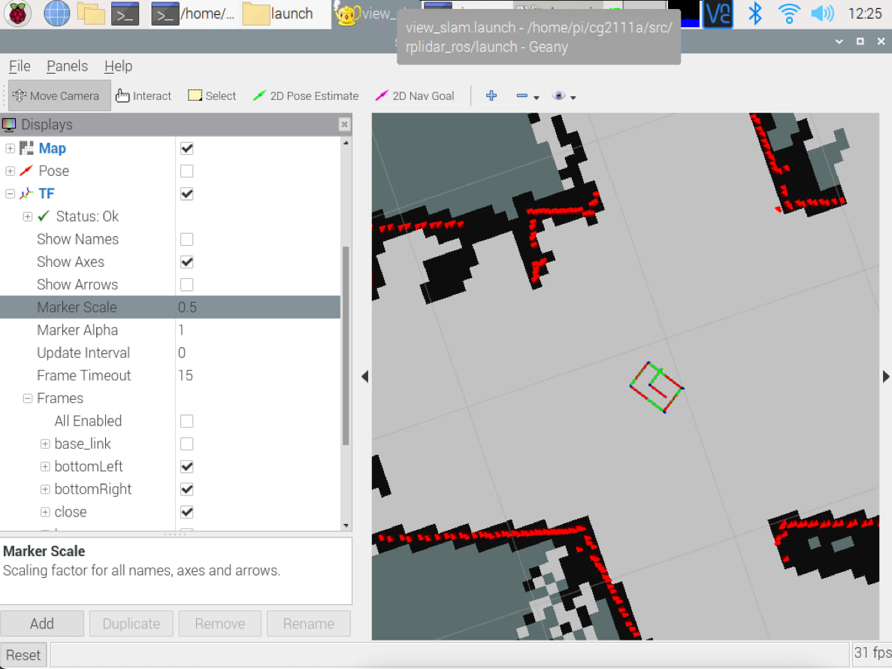

# Alex - The search & rescue robot

## Year 1 Semester 2 finale robot project for CG2111A module using RPLidar and Raspberry Pi.

Alex is a search and rescue robot designed to aid rescue efforts in the wake of natural disasters. Remotely controlled by an external operator, it can navigate through unfamiliar disaster terrains to detect presence of human life. In order to achieve this, a RPLidar sensor is mounted on Alex's top deck to map out its surroundings. The map will be relayed back to the operator who can reference it to remotely traverse Alex through the disaster terrain. Alex also has in-built voice communications via walkie-talkie to communicate with on-site emergency rescuers, further enhancing its search and rescue capabilities.

<div align="center">



*Front (left) and Top (right) view of Alex*



*Side (left) and Bottom (right) view of Alex*

</div>

## Setting up Alex

The following are the overall hardware connections of Alex:
- The Raspberry Pi is powered by the external power bank
- RPLidar is powered by and communicates with the RPi via USB connection
- Arduino Uno is powered by and communicates with RPi via USB connection (USB B port)
- Alex's motors are powered by 4xAA batteries (with DRV8883 H-bridge)

Upload the Arduino program called `Alex.ino` in `Alex` folder to the Arduino Uno. Other files`.ino` are tabs to the main file and should be compiled together. Ensure that they are recognised as tabs for the program to compile correctly.

Next, compile the `alex-pi.cpp` program to control Alex:
```bash
gcc alex-pi.cpp serial.cpp serialize.cpp -pthread -o Alex-pi
```

Run the generated executable file to start sending commands to the Arduino to operate Alex:
```bash
./Alex-pi
```

To view the map RPLidar generates:
```bash
source cg2111a/devel/setup.bash
roslaunch rplidar_ros view_slam.launch
```

## Hardware Features

### Aluminum heatsink casing with dual fan

The idle temperature of the RPi hovers around 50°C. The temperature would easily reach 70~80°C when we were running RViz, Hector SLAM and `Alex-pi` program simultaneously to operate Alex. At that temperature range, the RPi became less responsive, and it made it difficult to send commands to Alex and navigate it through the room. 

With the casing mounted, the **maximum** temperature of the RPi is **45°C** when running all the necessary programs for operation, which is much lower than the original idle temperature without the casing. However, one drawback of this approach was the additional weight of the aluminum casing, which will be discussed in limitations. 

Tips: If you want a quick alternative to offloading Hector SLAM to another ROS device, use this but beware of the additional weight it adds to Alex!

<div align="center">



*Aluminum heatsink casing with dual fan*

</div>

### Eyein UPRO-CHD32-2C Walkie Talkie

We chose our additional functionality to be a microphone and speaker system via the use of two Walkie Talkies, one attached to the Alex and one for the operator. In the real-world context, when Alex detects a victim, the survivor can use the on-built microphone to communicate with emergency personnel. 

This system aids in transmission of instructions or knowledge of environmental conditions, where both parties can hear and speak clearly to one another remotely using the Walkie Talkie. This thus assists on-site rescuers to locate the trapped victims using details provided by the victim, on top of the navigation map. 

The Walkie Talkie is mounted to the back of Alex using Velcro cable ties and operates using 4 integrated AAA batteries.

## Software Features

### Improving control mapping and efficiency

The given template code uses controls: f (forward), b (reverse), l (left) and r (right) which are very unintuitive to operate Alex. We changed the mapping of the movement controls to the standard WASD keys, which is a popular key binding for video games. The added intuitive nature reduces the chance of keying the wrong command. 

```cpp
#include <unistd.h>
#include <termios.h>

char getch() {
	char buf = 0;
	struct termios old = {0};
	if (tcgetattr(0, &old) < 0)
			perror("tcsetattr()");
	old.c_lflag &= ~ICANON;
	old.c_lflag &= ~ECHO;
	old.c_cc[VMIN] = 1;
	old.c_cc[VTIME] = 0;
	if (tcsetattr(0, TCSANOW, &old) < 0)
			perror("tcsetattr ICANON");
	if (read(0, &buf, 1) < 0)
			perror ("read()");
	old.c_lflag |= ICANON;
	old.c_lflag |= ECHO;
	if (tcsetattr(0, TCSADRAIN, &old) < 0)
			perror ("tcsetattr ~ICANON");
	return (buf);
}
```

### Using Transform Frame (TF) to model Alex in RViz

We were shown to display the pose of the lidar as an arrow on the map in RViz. However, this arrow is quite inaccurate at displaying the position of Alex on the generated map. 

Hence, we implemented additional markers that are positioned offset relative to the lidar’s position using **Transform Frame** (TF). Each marker by default is modeled with 3 axis which can be rotated to form the corners of Alex. We used 5 markers to outline the boundaries of Alex on the RViz map. (4 for each corner and 1 to return to the first marker)

<div align="center">



*Aluminum heatsink casing with dual fan*

</div>

The template to add one TF marker into RVis is shown below. 

```xml
<launch>
<node pkg="tf2_ros" type="static_transform_publisher" name="marker_name" args="x y z yaw pitch roll parent_frame child_frame" />
</launch>
```

- `parent_frame`: 
- `child_frame`: 
- `marker_name`: Name of each marker to be shown in TF element in RVis
- `x`, `y`, `z`: Offset in x,y,z axes from `parent_frame`
- `yaw`, `pitch`, `roll`: Rotation (in radians) of marker relative to `parent_frame`

We added the following code snippet into the `view_slam.launch` file and add the TF element within RViz. Next, we also needed to display the correct markers within the TF settings to achieve the above effect.

```xml
<launch>
<node pkg="tf2_ros" type="static_transform_publisher" name="marker1" args="0.13 -0.06 0 1.57 0 0 laser topRight" />
<node pkg="tf2_ros" type="static_transform_publisher" name="marker2" args="0.14 0 0 1.57 0 0 topRight topLeft" />
<node pkg="tf2_ros" type="static_transform_publisher" name="marker3" args="0.2 0 0 1.57 0 0 topLeft bottomRight" /> 
<node pkg="tf2_ros" type="static_transform_publisher" name="marker4" args="0.14 0 0 1.57 0 0 bottomRight bottomLeft" /> 
<node pkg="tf2_ros" type="static_transform_publisher" name="marker5" args="0.2 0 0 1.57 0 0 bottomLeft close" />
</launch>
```

Tips: This is a quick and easy implementation, add this from the start of your project!

### Color detection implementation


## Limitations

